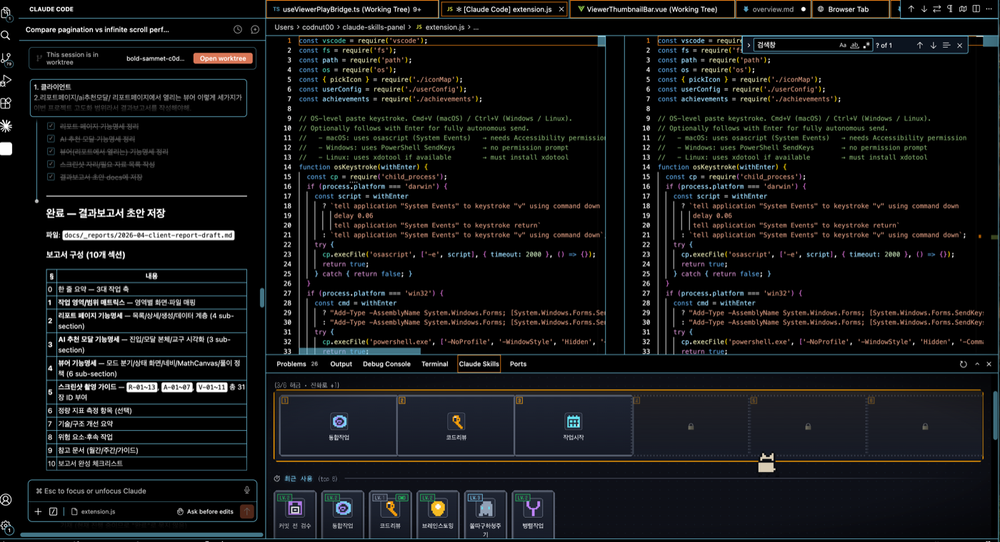
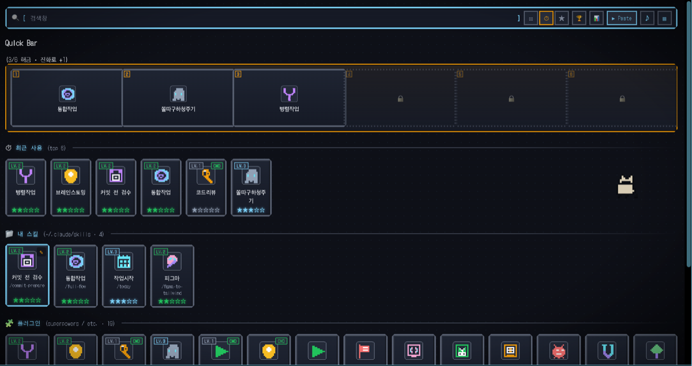

# Claude Code Skills Panel

> 스킬 외우기 귀찮아서 GUI로 만들었는데 게임이 됐음.

**Claude Code** 의 모든 스킬·명령어를 픽셀 아트 패널에서 탐색하고, 클릭 한 번으로 즉시 실행 — 육성형 미니 게임 포함.

---

## 미리보기

### 하단 패널 (넓은 화면)


### 액티비티바 사이드 패널


---

## ✨ 기능

### 🔍 스킬 자동 탐색
- `~/.claude/skills/` — 사용자 커스텀 스킬
- `<project>/.claude/skills/` — 프로젝트 스킬
- `~/.claude/plugins/cache/**` — superpowers 등 **모든 설치된 플러그인** (SKILL.md + commands/*.md 모두)

### 🎮 인터랙션
| 동작 | 결과 |
|---|---|
| 카드 클릭 | `/skill` 복사 (또는 자동 실행) |
| 카드 우클릭 | SKILL.md 열기 |
| Quick Bar 드래그 | 슬롯에 등록 (키 1~6) |
| ✎ 클릭 | 별칭·아이콘·메모 편집 |

### ⚡ Quick Bar (단계별 해금)
6개 슬롯을 **드래그**로 등록, 키보드 1~6으로 즉시 트리거.  
캐릭터 진화 단계에 따라 슬롯이 하나씩 해금됩니다.

```json
// keybindings.json에 추가하면 패널 비활성시에도 즉시 실행
{ "key": "cmd+shift+1", "command": "claudeSkills.quickSlot1" }
```

### 🚀 실행 모드
- **▶ Paste** — 클립보드에 복사 (기본)
- **▶ Auto** — 포커스 + 자동 붙여넣기 + Enter (macOS / Windows / Linux)
- **▶ Term** — 활성 터미널에 직접 송신

### ✏️ 커스터마이징
- **별칭(Alias)** — 짧은 이름으로 변경
- **메모(Note)** — hover 팝오버에 표시
- **커스텀 아이콘** — 내 이미지 업로드 (PNG/SVG/JPG/GIF)
- **숨김** — 잘 안 쓰는 스킬 정리
- 설정 저장: `~/.claude/skills-panel-config.json` (dotfiles 동기화 OK)

### 🐾 Claude Buddy 육성

스킬을 사용할수록 같이 성장하는 작은 친구.

| 단계 | 조건 | 모습 |
|---|---|---|
| 🥚 Egg | 0+ | 알 |
| 🟢 Hatchling | 10+ | 초록 새끼 |
| 🐱 Kitten | 30+ | 크림색 새끼고양이 |
| 🐈 Cat | 100+ | 회색 고양이 |
| 🦊 Monkey | 300+ | 원숭이 |
| 🐲 Dragon | 1000+ | 파란 드래곤 |

패널 안에서 자유롭게 돌아다니다가, 스킬 클릭 시 해당 카드 옆으로 달려옵니다. 클릭하면 캐릭터 시트 확인 가능.

**스탯**: 🧠 INT (사고형 스킬) / ⚡ DEX (Quick Bar) / ❤️ VIT (스트릭) / 🍀 LCK (업적)

### 🏆 메타게임
- **16개 업적** — 사용량 / 다양성 / 스트릭 / 마스터리 / 커스텀
- **위클리 리포트** — 7일 활동 그래프 + TOP 5 스킬 (`📊` 버튼)
- **마스터리 ★** — 스킬별 LV.1~5, 레벨업 시 사운드 + 연출

### 🎨 도트 게임 UI
- DotGothic16 + Press Start 2P 픽셀 폰트
- 30개 spark 스타일 스킬 아이콘 (통일된 다크 프레임)
- CRT scanlines / vignette 효과 (토글)
- 8-bit Web Audio 사운드 (토글)
- 카드 hover sparkle, click shake, fade-up 애니메이션

---

## 📥 설치

**Cursor / VSCode**
> Extensions 탭에서 `Claude Code Skills Panel` 검색 → Install

**수동**
```bash
git clone https://github.com/parksubeom/claude-skills-panel
cd claude-skills-panel
npm install
npm run package
# 생성된 .vsix 파일을 "Install from VSIX..."로 설치
```

---

## ⌨ 키바인딩 (선택)

`Cmd+Shift+P` → `Preferences: Open Keyboard Shortcuts (JSON)` 에 추가:
```json
[
  { "key": "cmd+shift+1", "command": "claudeSkills.quickSlot1" },
  { "key": "cmd+shift+2", "command": "claudeSkills.quickSlot2" },
  { "key": "cmd+shift+3", "command": "claudeSkills.quickSlot3" }
]
```

---

## 🛠 개발

```bash
npm run build:spark    # spark 스타일 스킬 아이콘 30개
npm run build:buddy    # 버디 캐릭터 6단계
npm run package        # .vsix 패키징

# 배포
npx ovsx publish -p <token>   # OpenVSX (Cursor)
npx vsce publish              # VSCode Marketplace
```

---

## 📝 라이선스
MIT · [parksubeom](https://github.com/parksubeom)
